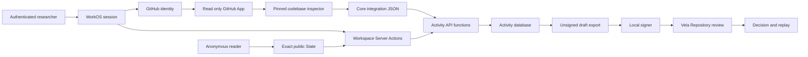

# Vela Web connected-codebase and Workspace threat model

**Status:** reviewed current control document

**Scope date:** 2026-08-14

**Repository baseline:** Problems 0.438.0 connected-codebase contribution model

**Owner:** Vela Web maintainers

**Authority effect:** none

## Executive summary

The highest-risk boundaries are selected private-repository access and the
crossing from mutable hosted activity into an unsigned Submission. A
cross-account installation claim, webhook forgery, archive escape, token leak,
or stale scientific anchor could expose private work or create a persuasive but
incorrect handoff. WorkOS identity, GitHub identity, GitHub App access, hosted
Activity, and Vela Repository authority are therefore separate axes. The App
has read-only selected-repository access; installation tokens and source bytes
remain transient; imports pin an immutable commit and tree; Core inspection is
bounded and authority-neutral; SQL is tenant-scoped; and no hosted path signs,
verifies, decides, or changes Standing.

## Scope and assumptions

In scope:

- `apps/problems/src/app/actions/activity.ts` and the authenticated draft
  export handler;
- `apps/problems/src/components/vela/workbench.tsx` as the only hosted
  activity presentation surface, with `workspace-shell.tsx`,
  `workspace-canvas.tsx`, and `workspace-crdt-note.tsx` as its bounded child
  surfaces;
- `apps/problems/src/lib/auth.ts` and `apps/problems/src/proxy.ts` for the
  hosted-account boundary;
- `apps/problems/src/app/api/github`, `apps/problems/src/app/import`, and
  `apps/problems/src/lib/{github-app,github-install-state,codebase-inspection}.ts`
  for identity, selected-repository access, webhooks, and immutable import;
- `apps/problems/src/app/api/telemetry/route.ts` and
  `packages/activity-data/schema/pilot-telemetry.sql` as the product's first
  unauthenticated Internet-facing write. It carries no session, so every
  control is admission-side: a required JSON content type that forces a
  preflight, a 4 KB body bound, a closed strict schema, a global hourly
  ingestion ceiling, and a per-install budget that binds only an honest client
  because `install_id` is client-minted;
- `packages/activity-data/src`, its migrations, roles, database privilege
  bootstrap, migration runner, role verifier, and live proof;
- `packages/activity-data/schema/github-codebases.sql` and
  `packages/projection-data/src/core-integration.ts`; and
- `scripts/scientific-authority-boundary.mjs` and public-output checks.

Out of scope:

- Vela Repository admission, Verification, Decision, Event creation, replay,
  and Standing; those remain local/canonical Vela concerns;
- the Formal Conjectures audit generator and execution sandbox, which require a
  separate companion threat model;
- WorkOS, Neon, Vercel, Git hosting, or operator-device internals beyond how
  this repository configures their boundaries; and
- confidentiality of public scientific State and public source-owned Research
  Blocks.

Assumptions confirmed for this pilot:

- the product is Internet-exposed; scientific State is public and hosted
  activity requires a valid WorkOS session;
- the activity database is multi-workspace, and `owner` and `member` currently
  have the same rights for eligible activity mutations;
- GitHub App permissions are exactly Metadata read and Contents read for
  selected repositories; there is no GitHub write or Actions dependency;
- imported private source is processed transiently on the server and must not
  enter Neon, logs, HTML, public records, or Vela objects;
- object authorship grants no extra mutation right, except that a private note
  is readable only by its author;
- Attempt and Artifact locators are visible to every member of their Workspace,
  but must not enter signed-out or public output; and
- a local signer, eligible verifier, or Repository Decision authority receives
  no additional hosted-activity right merely because it holds that external
  role.

Open questions that can change future risk, but do not block this design:

- whether a later product policy needs recipient-scoped private locators;
- whether Workspace membership administration will become an application
  surface rather than an operator-only/database concern; and
- what authenticated-write quotas are appropriate once usage and artifact
  locator sensitivity are measured.

## System model

### Primary components

- **Public scientific reader.** `@vela/projection-data` reads an exact,
  SELECT-only projection. It does not depend on mutable activity data.
- **Hosted account adapter.** `currentAccount()` validates configuration and
  obtains the WorkOS session identity. The WorkOS identity is explicitly not a
  Vela actor (`apps/problems/src/lib/auth.ts`,
  `packages/activity-data/migrations/20260811_activity_v1.sql`).
- **GitHub connection adapter.** WorkOS supplies a GitHub external identity;
  the separate GitHub App supplies selected-repository access. HMAC state plus
  the signed installation webhook binds the two without storing an OAuth or
  installation token (`apps/problems/src/app/api/github`).
- **Immutable codebase inspector.** Octokit resolves a full commit and tree,
  downloads that exact archive, extracts only bounded regular files and
  directories into a temporary checkout, and calls the pinned Core integration
  inspect/check JSON contracts (`apps/problems/src/lib/codebase-inspection.ts`,
  `packages/projection-data/src/core-integration.ts`).
- **Workspace Server Actions.** The single declared mutation surface parses
  bounded form fields, reloads exact scientific State, recomputes the anchor,
  requires the browser-rendered expected anchor, and maps the WorkOS identity
  to an activity account (`apps/problems/src/app/actions/activity.ts`).
- **Activity data package.** Server-only TypeScript validates contracts,
  canonicalizes request roots and drafts, and calls a fixed SQL function
  vocabulary (`packages/activity-data/src/activity.ts`).
- **Activity database.** The `vela_activity_app` role has only `USAGE` on
  `activity_api` and `EXECUTE` on reviewed functions. Tenant, anchor,
  idempotency, lifecycle, visibility, and version policy lives in
  `SECURITY DEFINER` functions with a fixed search path
  (`packages/activity-data/migrations/20260811_activity_v1.sql`).
- **Workspace CRDT stream.** Members append content-rooted Loro update bytes to
  one `canvas` document per exact Problem anchor. SQL recomputes SHA-256, caps
  each update at 256 KiB, audits the write, and returns bytes only through a
  membership-gated read function. The app role has no table access
  (`packages/activity-data/migrations/20260813_workspace_crdt.sql`).
- **Local signer.** A separate CLI reads an explicit local PKCS#8 file, checks
  the public key declared by the draft, signs a DSSE envelope, and creates a
  new mode-0600 output file (`packages/activity-data/scripts/sign-submission-draft.mjs`).
- **Boundary gates.** Static checks keep the mutable and scientific planes
  acyclic, disallow hosted authority secrets and signing, and scan public output
  (`scripts/scientific-authority-boundary.mjs`,
  `scripts/check-public-output.mjs`).

### Data flows and trust boundaries

- **Anonymous browser -> Problems reader.** Public HTTP reads carry no
  activity credential. Exact State and source-owned public Research Blocks are
  available; `Workbench` returns the sign-in surface before loading any
  activity data. Validation is the read-model's exact-root contract.
- **Browser -> WorkOS -> hosted account adapter.** The browser carries the
  AuthKit session cookie over the deployed HTTPS boundary. Repository evidence
  shows configuration validation and `withAuth()` use; rate limiting and
  provider-internal session controls are not established here.
- **GitHub setup -> WorkOS identity -> Activity.** A ten-minute HMAC state is
  bound to the hosted account and WorkOS GitHub identity and is also stored in
  an HttpOnly SameSite cookie. The installation can be claimed only after a
  signature-verified webhook recorded the same installer GitHub user id.
- **GitHub webhook -> Activity.** Octokit verifies the raw-body HMAC before a
  closed event projection is retained. Delivery ids are unique and a reused id
  with changed event or body root is rejected; no raw payload or token is stored.
- **Selected/public GitHub repository -> temporary checkout -> Core.** Both
  methods resolve one immutable commit/tree and use the same archive and Core
  inspection path. URL normalization allows only canonical GitHub HTTPS
  repository URLs; archive entries, counts, compressed/expanded bytes, HTTP,
  and Core subprocess time are bounded. Temporary bytes are removed in `finally`.
- **Authenticated form -> Workspace Server Action.** Form data carries route
  scope, Workspace id, expected scientific-anchor root, idempotency key, and
  bounded activity fields. Server Actions validate lengths, reload State, and
  reject anchor drift before calling activity data. There is no generic
  activity POST Route Handler.
- **Server Action -> `vela_activity_app`.** Parameterized Neon queries carry an
  activity account id, Workspace id, command kind, request root, payload, and
  expected version. SQL requires membership, serializes idempotency keys, and
  applies composite Workspace/anchor relationships. The app role cannot access
  base tables or the Problems database.
- **Canvas editor -> Loro -> activity API.** The browser imports retained Loro
  updates, exports only its new delta, computes the update root, and posts it to
  the declared Workspace Server Action. SQL independently validates the bytes
  and root before retaining the append-only activity row.
- **Activity package -> external locator.** Only a locator string, content
  root, bounded metadata, and optional byte count are retained. No bytes are
  fetched or stored. Locator text is untrusted and currently displayed as text
  inside an authenticated Workspace.
- **Draft export -> local signer.** An authenticated member downloads canonical
  unsigned JSON with `private, no-store` and exact payload headers. The local
  CLI, not hosted code, reads a private key and writes the signed envelope.
- **Signed Submission -> Vela Repository.** This occurs outside Vela Web.
  Repository policy, scoped Verification, an authorized attributed Decision, and
  replay govern any scientific effect.

#### Diagram

## Assets and security objectives

| Asset | Why it matters | Security objective |
|---|---|---|
| Workspace membership and account mapping | Prevents cross-tenant reads and writes | C, I |
| Private notes and hosted locators | May contain unpublished research or custody locations | C, I |
| Scientific anchor | Determines which exact Problem State activity references | I |
| Activity records and append-only audit | Preserve coordination history, authorship, idempotency, and conflict evidence | I, A |
| Workspace CRDT update stream | Preserves mergeable shared-note context without implying scientific authority | I, A |
| Unsigned Submission payload and payload root | Defines the exact bytes a user may choose to sign | I |
| WorkOS secrets and activity database credential | Compromise permits hosted identity or data-plane abuse | C, I, A |
| GitHub App private key, webhook secret, and installation tokens | Compromise permits private-repository reads or forged lifecycle input | C, I |
| Private repository source bytes | Unpublished source must remain transient and tenant-scoped | C, I |
| Immutable import commit/tree and inspection receipt | Prevent branch movement or provider metadata from rewriting an existing import | I |
| Local signing key | Controls producer attribution outside the hosted service | C, I |
| Scientific projection and Repository authority credentials | Must remain unreachable from mutable hosted activity | C, I |
| Public output | Must not disclose private account, locator, registry, or secret material | C, I |

## Attacker model

### Capabilities

- An anonymous Internet user can manipulate public URLs and unauthenticated
  requests.
- An authenticated account can submit arbitrary form values, guess UUIDs,
  reuse idempotency keys, race versions, supply long or malicious text, and try
  to bind activity to a stale or substituted scientific object.
- A malicious Workspace member can read all Workspace-visible activity and
  locators and can perform every currently eligible member mutation.
- A remote attacker can send forged, replayed, oversized, or cross-account
  GitHub setup/webhook requests and submit malicious public repository archives.
- Untrusted artifact locators may contain misleading schemes, prompt injection,
  or references to mutable bytes.
- A supply-chain or deployment attacker may attempt to introduce a hosted
  signer, authority credential, permissive database grant, or second write
  route.

### Non-capabilities

- Mere membership, object authorship, a passing producer check, local signing,
  or verifier status does not grant Repository Decision authority.
- The normal application role cannot read activity base tables, connect to the
  Problems database, create roles/databases, or access a Repository key.
- The current product neither fetches artifact locators nor runs external
  sessions or contributor code.
- GitHub identity, installation ownership, repository administration, pull
  requests, checks, and merges grant no Vela authority or hosted signer access.
- Vela Web does not make scientific truth, fidelity, acceptance, or
  independence claims from hosted activity.

## Entry points and attack surfaces

| Surface | How reached | Trust boundary | Notes | Evidence |
|---|---|---|---|---|
| Public State routes | Anonymous HTTP GET | Internet -> exact reader | SELECT-only scientific projection | `apps/problems/src/app/p/[repository]/[problem]/page.tsx`; `AGENTS.md` |
| AuthKit proxy and `currentAccount` | Browser session | Internet -> WorkOS -> app | Hosted identity only; validates redirect and cookie configuration | `apps/problems/src/proxy.ts`; `apps/problems/src/lib/auth.ts` |
| GitHub connection adapter | WorkOS GitHub identity, signed App installation, selected repository metadata | Internet -> GitHub -> app -> Activity | HMAC-bound setup state; Octokit webhook verification; delivery-root deduplication; short-lived read-only installation tokens; no source-byte or token persistence | `apps/problems/src/lib/github-app.ts`; `apps/problems/src/app/api/github`; `packages/activity-data/schema/github-codebases.sql` |
| Core integration inspector | Temporary exact GitHub archive at an immutable commit | app -> pinned released Vela 0.977.6 CLI | Bounded link-free extraction; closed authority-neutral JSON; temporary bytes removed after inspection | `apps/problems/src/lib/codebase-inspection.ts`; `packages/projection-data/src/core-integration.ts` |
| Workspace Server Actions | Authenticated form submit | Browser -> server | One declared action file; recomputes exact anchor | `apps/problems/src/app/actions/activity.ts` |
| Draft export | Authenticated GET | Browser -> server -> activity API | Membership-required canonical bytes; private/no-store | `apps/problems/src/app/drafts/[id]/export/route.ts`; `activity_api.export_submission_draft` |
| Activity SQL API | Parameterized SQL | server -> separate database | `SECURITY DEFINER`, fixed search path, membership and command allowlist | `packages/activity-data/src/activity.ts`; `packages/activity-data/migrations/20260811_activity_v1.sql` |
| Artifact locator fields | Authenticated forms | untrusted text -> Workspace | Stored as metadata; not fetched; Workspace-visible | `attachArtifactAction`; `RootedArtifactFrame` |
| Local signing CLI | Local filesystem/CLI | unsigned hosted bytes -> user key | Explicit file paths, key match, exclusive mode-0600 output | `packages/activity-data/scripts/sign-submission-draft.mjs`; `src/local-signing.ts` |
| Migration and role tooling | Operator CLI | operator -> Neon | Separate migrator/app credentials; exact migration ledger | `packages/activity-data/scripts/schema.mjs`; `scripts/verify-roles.mjs` |
| Build and boundary gates | CI/local Bun commands | source -> deployable artifact | Static authority and public-output policy | `scripts/scientific-authority-boundary.mjs`; `scripts/check-public-output.mjs` |

## Top abuse paths

1. **Cross-tenant exfiltration.** An authenticated attacker guesses a Workspace
   UUID, substitutes it in a Work URL, and asks the app role to return activity.
   `require_membership` must refuse before rows or private notes are selected.
2. **Stale anchor substitution.** A member leaves a page open, the exact source
   advances, and the member posts the old Problem anchor. The Server Action must
   reload State and refuse rather than silently attach an Approach to a successor.
3. **Draft evidence substitution.** A member names an artifact digest in a
   draft that is not a selected, same-anchor Workspace Artifact or provides a
   payload root that does not match canonical bytes. A plausible handoff could
   then be locally signed without having crossed the intended evidence path.
4. **Hosted-authority creep.** A later change imports signing code or a
   Repository credential into an app route, then presents producer output as a
   Verification or Decision. Static boundary gates must fail before deployment.
5. **Private activity disclosure.** A private note, account identifier, or
   Workspace-visible locator is accidentally projected into a signed-out page,
   JSON read contract, client asset, log, or public editorial build.
6. **Locator/prompt injection.** A member stores a malicious locator or text;
   a later UI turns it into an active link or an agent follows it as an
   instruction. The current UI's inert text is safe only while that behavior is
   preserved.
7. **Retry/race corruption.** A client reuses an idempotency key with changed
   bytes or races an Attempt/draft version, producing duplicate or overwritten
   activity. Transaction locks, request roots, and expected versions must fail
   closed.
8. **Database-role escape.** A grant regression gives the app role base-table,
   TEMP, cross-database, or function-creation rights, bypassing audited policy
   functions and threatening both tenants and scientific-plane separation.
9. **Resource exhaustion.** An authenticated account creates many Workspaces or
   bounded-but-numerous activity records or CRDT updates; without quotas it can consume
   database, build, or review capacity.
10. **Authority-by-presentation.** A dashboard, audit entry, passing producer
    check, or activity relationship is styled as accepted scientific State even
    though no Repository Decision exists.
11. **Installation substitution.** An attacker starts a setup flow for one
    account and substitutes another installation id. The signed cookie/state,
    WorkOS GitHub id, signed created webhook, and SQL installer-id claim must all
    agree before repository access is listed.
12. **Private repository exfiltration.** A token or archive leaks through logs,
    HTML, Neon, an error string, or a retained temporary path. Tokens remain
    memory-only, stored inspection data is bounded metadata, logs are disabled,
    and temporary checkout removal runs on success and failure.
13. **Archive/parser abuse.** A repository supplies traversal, links, device
    nodes, expansion bombs, huge counts, or input that stalls Core. The importer
    rejects unsafe types and paths and bounds size, count, HTTP time, Core time,
    and output bytes.
14. **Branch movement confusion.** A later push changes the default branch and
    a UI silently treats the old import as updated. The webhook only marks
    `branch_moved`; the original commit, tree, inspection, and receipt never change.

## Threat model table

| Threat ID | Threat source | Prerequisites | Threat action | Impact | Impacted assets | Existing controls | Gaps | Recommended mitigations | Detection ideas | Likelihood | Impact severity | Priority |
|---|---|---|---|---|---|---|---|---|---|---|---|---|
| TM-001 | Authenticated outsider or stolen app credential | Workspace/account identifiers or app DB access | Read or mutate another Workspace by substituting ids | Unpublished research exposure and activity corruption | Membership, notes, locators, records | WorkOS session in `currentAccount`; SQL `require_membership`; composite Workspace/anchor FKs; cross-tenant live proof | SQL functions trust the account id supplied by the server credential | Keep DB credential server-only; retain read, write, export, and removed-member probes in `live-proof.mjs`; alert on repeated `VA403` | Count authorization refusals without logging sensitive payloads | medium | high | high |
| TM-002 | Malicious or stale member client | Valid membership and an old/substituted Problem anchor | Attach an Approach to an unseen successor | False provenance and incorrect downstream promotion | Scientific anchor, draft | Exact server write gate; `mutationContext` reloads State; `requireExpectedAnchorRoot`; Problem-scoped database migration; direct-form and disposable-database tests | A compromised application credential can still supply an old anchor unless the server performs the fresh read | Keep the exact anchor re-read and refusal at the action boundary; freeze retired bound rows; retain audit conflict outcomes | Audit anchor conflicts | medium | high | high |
| TM-003 | Supply-chain/deployment change | Ability to change or deploy hosted code/config | Add signer, Verification/Decision writer, authority key, or scientific table | Unauthorized scientific action or credential theft | Local key, Repository authority, Standing | Static authority scanner; app/local signer dependency split; role/database separation; no secret columns | Static patterns are not a complete semantic proof | Keep forbidden symbols/schemas/secrets executable; review any activity boundary-file change; scan deployment config and output | CI gate failures; secret-scanner alerts; unexpected environment keys | low | high | high |
| TM-004 | Workspace member or compromised app | Draft creation/export rights | Substitute artifact, payload, or root before local signing | Signed proposal does not reflect selected evidence | Artifact roots, draft bytes | The action derives the payload Artifact from the selected stored Research Block; Ajv closed schema and canonical JSON/root checks; SQL requires the same-Workspace/same-anchor Artifact id, refuses draft rebinds, and the 20260814 migration rejects new execution lineage; membership-gated export; key match in local signer | SQL does not independently compare the payload Artifact digest/path with the selected Artifact or recompute the canonical payload root; a compromised application credential remains able to supply inconsistent payload bytes | Keep application derivation mandatory; retain exact Artifact and no-rebind checks, export canonicalization, and focused substitution/root tests; add a database-owned payload-to-Artifact comparison before any broader promotion surface | Root mismatch telemetry without payload content | low | high | high |
| TM-005 | Outsider, member, build leak | Route/bundle access or Workspace membership | Expose private note, PII, or locator beyond its intended audience | Confidentiality breach | Notes, account data, locators | Private-note author filter; signed-out Workbench exits before activity load; public-output scan; no public activity JSON route | Locators are Workspace-wide by current policy; no recipient-scoped locator type | Do not broaden visibility; add public-output fixture markers; consider locator privacy only after a concrete requirement | Public-output scan; access audit; incident marker search | medium | high | high |
| TM-006 | Malicious member or external source | Ability to enter text/locator | Store dangerous scheme, mutable reference, or prompt injection for a human/agent | Misleading custody, unsafe navigation, downstream agent compromise | Locators and operators | Length limits; React escaping; hosted artifact locator rendered as inert text; no fetch/runtime | No locator scheme or immutability policy; future consumers may activate it | Keep inert by default; before link/fetch, introduce allowlisted schemes, explicit access class, immutable-root verification, and agent instruction isolation | Log rejected schemes and fetch attempts | medium | medium | medium |
| TM-007 | Concurrent/retrying member | Valid mutation rights | Reuse key with changed input or overwrite a changed version | Duplicate, lost, or inconsistent activity | Activity records, audit | Canonical request root; advisory lock; idempotency table; Attempt/draft versions; live proof | Immutable record types have no update path; currentness is app-enforced | Preserve request-root and version checks; retain migration compatibility and concurrent-write tests | Conflict and idempotency-reuse counts | medium | medium | medium |
| TM-008 | Compromised app/migrator or grant regression | Database credential or migration rights | Bypass API functions or cross into scientific DB | Bulk tenant corruption or scientific-plane compromise | Both data planes, audit | NOINHERIT roles; PUBLIC revocations; fixed DB; no TEMP; app no base tables; bidirectional role verifier | Migrator remains privileged; role proof requires live credentials | Require review for role/migration files; run `db:verify` and live proof on frozen bytes; rotate compromised credentials | Database grant diff and role-verifier failures | low | high | medium |
| TM-009 | Authenticated resource attacker | Account access | Generate high volumes of bounded activity or expensive reads | Availability and cost degradation | Database and app availability | Field lengths; fixed command vocabulary; 100-entry audit read bound | No repository-evidenced per-account/workspace quotas | Measure first; add quotas/rate limits before public write expansion; bound future artifact list sizes | Per-account command rate, row growth, latency | medium | medium | medium |
| TM-010 | UI/consumer author | Ability to change presentation | Treat activity or producer checks as Verification/acceptance | Scientific authority confusion | User trust, Standing semantics | Product copy; separate State/activity planes; scanner forbids authority writes; explicit unsigned handoff | Copy checks cannot prove all visual implications | Retain `authority_effect: none`; render source/check/semantic/Standing axes separately; review copy and browser states | Wording-contract and screenshot review | medium | medium | medium |
| TM-011 | Malicious payload or old client | Draft/API access | Use unsupported schema or extra authority fields | Parser differential or authority smuggling | Draft integrity | Ajv 2020 closed schema; pinned schema root; SQL schema/agent boundary; parser fails closed | SQL alone performs fewer checks than TypeScript | Keep TypeScript validation mandatory; fail closed on versions; test unknown properties and schema roots | Invalid-schema outcome counts | low | high | medium |
| TM-012 | Malicious Workspace member | Valid membership and canvas write access | Submit malformed, oversized, repeatedly duplicated, or parser-hostile CRDT bytes | Client denial of service or activity growth | Workspace CRDT stream, browser availability | 256 KiB SQL limit; canonical base64; SHA-256 recomputation; exact anchor; idempotency; unique rooted update; Loro import; no scientific authority effect | No per-Workspace byte quota or compaction checkpoint yet | Measure update growth; add quotas and a rooted compaction profile before adding geometry, presence, or more CRDT documents | Refused-size/root counts, bytes per Workspace, client import errors | medium | medium | medium |
| TM-013 | Remote attacker or another tenant | Valid hosted account and substituted installation id | Claim or read another account's selected repositories | Private repository disclosure | Installation and private source access | HMAC account/identity state, HttpOnly cookie, WorkOS GitHub identity, signed webhook installer id, SQL single-owner claim | Depends on WorkOS `idp_id` retaining the GitHub user identity | Keep exact identity comparison and cross-account SQL hostile; fail closed when identity is absent or nonnumeric | Count claim refusals without installation details | low | high | high |
| TM-014 | Remote webhook attacker | Internet access to webhook route | Forge, replay, or mutate installation/repository lifecycle events | Unauthorized access inventory or stale continued access | Installation mapping and revocation | Octokit raw-body signature verification, 2 MiB body bound, closed event set, delivery/root deduplication | Provider delivery availability remains external | Retain signature/replay hostiles and alert on repeated invalid signatures or delivery drift | Invalid signature, reused delivery, and lifecycle refusal counts | low | high | high |
| TM-015 | Malicious repository owner | Public URL or selected repository access | Use archive traversal, links, expansion, file count, or slow Core parsing to escape or exhaust the service | Private file overwrite/read or availability loss | Server filesystem and availability | Canonical GitHub host, exact archive endpoint, no links/special files, path containment, byte/count bounds, 30-second HTTP/Core timeouts, temporary cleanup | No per-account import quota yet | Add per-account concurrency/rate bounds before wider launch; retain archive hostiles and build trace checks | Import duration, refusal reason, and concurrent import count without source paths | medium | high | high |
| TM-016 | Deployment/operator bug | GitHub App or Vercel configuration access | Leak App key, webhook secret, installation token, or private archive into logs/HTML/Neon | Private repository compromise | Provider credentials and private source | Server-only env, Octokit no-op logger, short-lived tokens, no token/source columns, bounded sanitized errors, private Activity reads | Deployment platform remains a trusted secret custodian | Keep exact env allowlist and credential/private-path scan; rotate App key and revoke installations after compromise | Unexpected env-name and log marker alerts | low | high | high |
| TM-017 | Build/deployment mistake | Public artifact generation | Ship private account/locator/secret material in browser or editorial output | Broad confidentiality loss | Secrets, PII, private research | Output scanner; activity dependency allowlist; signed-out activity gate | Marker scan is pattern-based | Add representative locator/account markers to public-output tests; inspect actual build output on release | CI scan and post-build artifact inspection | low | high | medium |
| TM-018 | Anonymous Internet attacker, or a third-party page conscripting its visitors | Network access to `POST /api/telemetry`; no account, session, or credential | Mint fresh `install_id` values and flood content-free rows, or drive cross-origin writes from visitors' browsers | Unbounded row growth in `vela_activity` contending for the Neon compute shared with the SELECT-only projection reader, degrading or halting every public Problem page; pseudonymous rows may also be re-identified | Activity database and public reader availability; pilot participant pseudonymity | Required `application/json` content type forces a preflight this route does not answer, so no CORS simple request reaches it; 4 KB body bound before parsing; strict closed schema refusing any unexpected field; global ceiling of 50,000 rows received per trailing hour; 90-day delete on the write path; `authority_effect='none'`; app role holds EXECUTE only, no table grants | The per-install budget of 5,000 bounds nothing globally because `install_id` is client-minted. The global ceiling is admission control, not a rate limit: a flood still consumes one indexed count per request, and once the ceiling is reached honest pilot records are refused alongside the flood. No edge rate rule is configured in the repository, and the shared-compute contention is a property of the Neon topology described in `docs/performance/2026-08-13-problems-latency-and-architecture.md` | Operator configures a Vercel WAF rate rule on `/api/telemetry` before invitations go out — that is the first line, and the SQL ceiling is the backstop behind it. Keep the ceiling well above plausible pilot volume. Drop `activity.pilot_telemetry` and its function when the pilot ends rather than retaining a pseudonymous corpus | Rows per hour and distinct `install_id` values per hour, both against the pilot's expected participant count; 22023 ceiling-refusal counts; 415 and 400 refusal counts; projection-reader latency correlated against ingestion volume | medium | medium | medium |
| TM-019 | Operator, provider insider, or anyone with request logs plus database read | Access to Vercel request logs and `activity.pilot_telemetry` | Join log client IP and timestamp to `received_at` to map IP to `install_id`, then correlate timing against `submission_drafts` and other activity to name the participant | Pilot participants are re-identified despite a design described as pseudonymous; a participant's failure and retry pattern becomes attributable | Participant pseudonymity; pilot consent boundary | No account, workspace, or anchor column; no join key to any other activity table; separate credential classes | Pseudonymity is a property of the row, not of the system. Vercel request logs record client IP and timestamp for every request, and `received_at` is a high-resolution join key; in a four-participant pilot, timing correlation against `submission_drafts` is sufficient to re-identify without any shared column. Separately, `^[0-9a-f]{32}$` is exactly the dashless form of a PostgreSQL `uuid`, so the `install_id` space overlaps `activity.accounts.id` by construction and a future join could be written without any schema change signalling it | Tell pilot participants that telemetry is pseudonymous, not anonymous, rather than describing it as unlinkable. Keep the retention window short and drop the table at pilot end. Do not add a `uuid`-typed column or any cast between `install_id` and an account id; if the overlap ever becomes load-bearing, change the identifier's alphabet so the two spaces cannot be silently joined | Review of any future query or migration that references both `pilot_telemetry` and an identity-bearing table; log-retention window review | low | medium | medium |

## Exact implementation permission matrix

This matrix records current behavior. It is not aspirational. “Author” means an
object's `created_by_account_id`, `author_account_id`, or equivalent; authorship
adds no mutation right except private-note read. “External role” means local
signer, eligible verifier, or Decision authority without a Workspace
membership. Any cell not explicitly allowed is denied.

| Object / action | Anonymous | Hosted account, no membership | Workspace owner | Workspace member | Object author | External role | Hosted service enforcement |
|---|---|---|---|---|---|---|---|
| Read public Current State and source Research Blocks | allow | allow | allow | allow | no extra right | allow | exact `@vela/projection-data` read; no activity credential |
| Sync own hosted Account | deny | allow | allow | allow | no extra right | no extra right | `currentAccount` -> `ensureCurrentAccount` -> `activity_api.ensure_account` |
| Create Workspace / list own Workspaces | deny | allow | allow | allow | no extra right | no extra right | `createWorkspaceAction`; `activity_api.create_workspace`; `list_workspaces` joins membership |
| Read Workspace activity | deny | deny | allow | allow | no extra right | no extra right | `Workbench` -> `getProblemActivity`; SQL `require_membership` |
| Read private note | deny | deny | allow only if author | allow only if author | allow within own Workspace | no extra right | `x.visibility='workspace' OR x.author_account_id=p_account_id` |
| Read Attempt or Artifact locator | deny | deny | allow | allow | no extra right | no extra right | returned only by membership-gated activity read; no public activity route |
| Follow exact current anchor | deny | deny | allow | allow | no extra right | no extra right | `followProblemAction`; expected-anchor guard; `follow.set` |
| Create Problem-scoped Approach | deny | deny | allow | allow | no extra right | no extra right | `createApproachAction`; expected-anchor guard; `approach.create` |
| Fork Approach | deny | deny | allow | allow | no extra right | no extra right | current anchor + expected version in action; membership + version in `approach.fork` |
| Create/update Attempt | deny | deny | allow | allow | no extra right | no extra right | current Approach/Attempt guard; membership; lifecycle and optimistic version policy |
| Add comment/private note | deny | deny | allow | allow | no extra write right | no extra right | same-anchor checks; private read remains author-only |
| Attach Artifact reference | deny | deny | allow | allow | no extra right | no extra right | same-anchor checks; roots/metadata only |
| Create unsigned draft | deny | deny | allow | allow | no extra right | no extra right | current-anchor action; selected same-anchor Artifact; Ajv schema; agent/CI identity match; `submission_draft.save` |
| Export canonical unsigned draft | deny | deny | allow | allow | no extra right | no extra right | authenticated GET; `export_submission_draft`; `private, no-store` |
| Sign Submission | deny | deny | deny as hosted role | deny as hosted role | no extra right | allow only at local boundary with matching declared key | hosted import/signing/key access forbidden; local CLI only |
| Produce Verification / issue Decision / change Standing | deny | deny | deny | deny | deny | governed by external Repository policy, never hosted role | no handler, table, function, credential, or allowed schema |

### Handler, policy, role, and test bindings

| Capability | Current handler or command | Database policy/function | Role boundary | Executable evidence |
|---|---|---|---|---|
| Hosted identity | `currentAccount`; `actor` | `activity_api.ensure_account` validates WorkOS-shaped id | app role may execute only | `apps/problems/src/lib/auth.test.ts`; `apps/problems/src/app/actions/auth.test.ts` |
| Workspace create/list | `createWorkspaceAction`; `listWorkspaces` | `create_workspace`; membership join in `list_workspaces` | app API only | `packages/activity-data/tests/governance.test.ts`; live proof |
| Activity read/privacy | `loadWorkbench` | `get_problem_activity`; `require_membership`; author-only private-note predicate | app API only; no base read | governance test; live cross-tenant/private-note proof |
| Workspace-scoped activity mutations | declared exports in `app/actions/activity.ts`; Problem-scoped creation uses one closed database command; CRDT append uses its own byte-validating function | closed command allowlist; dedicated CRDT append; `require_membership`; append-only audit | app API only | governance test; authority-boundary test; disposable Postgres proofs |
| Shared canvas note | `appendWorkspaceCrdtUpdateAction`; Loro client delta export | `append_workspace_crdt_update`; `list_workspace_crdt_updates`; exact root/size/anchor checks | app API only; no base read/write | `workspace-crdt.test.ts`; CRDT merge-order tests |
| Direct stale form refusal | `mutationContext`; `requireExpectedAnchorRoot` | database preserves exact supplied anchor but does not decide currentness | server owns current scientific read | `workspace-mutation-guard.test.ts` |
| Version/idempotency conflict | `requireCurrentApproach`; `requireCurrentAttempt`; command request root | advisory lock; `VAI01`; `VACAS`; lifecycle transitions | app API only | guard tests; migration-plan tests; live proof |
| Draft validation/export | `saveSubmissionDraftAction`; `GET /drafts/[id]/export` | `submission_draft.save`; selected Artifact id; `export_submission_draft`; membership | app API only | `draft-submission.test.ts`; governance tests; live export denial |
| Local signature | `activity:submission:sign-local` | none | local filesystem and user key; no server right | `draft-submission.test.ts` success and mismatched-key refusal |
| Role/cross-plane isolation | operator scripts only | grants/revocations; fixed DB identity | owner, migrator, app, projection reader separated | `boundary.test.ts`; `db:verify`; `db:live-proof` |
| Scientific authority denial | no hosted capability | no activity scientific relation/function | no Repository credential | `scientific-authority-boundary.test.ts`; `check:boundary` |

## Criticality calibration

- **Critical:** an unauthenticated or ordinary member path directly signs a
  Repository action, extracts a Repository authority key, or changes canonical
  Standing. A cross-plane database escape with immediate canonical write access
  is also critical. No current path meeting this definition was found.
- **High:** cross-tenant Workspace disclosure or corruption; accepting a stale
  or substituted Problem anchor into a promoted draft; exporting private
  research publicly; or introducing a hosted signer/Decision path. TM-001
  through TM-005 fall here.
- **Medium:** locator/prompt abuse without automatic execution; bounded
  availability attacks; idempotency/version conflict; a privileged migration
  regression caught by release verification; or activity presented with
  misleading authority semantics.
- **Low:** cosmetic metadata leakage already visible to all intended Workspace
  members, noisy authenticated failures, or a denial of service that is
  trivially reversible and affects no retained data. No low item is used to
  waive a required boundary test.

## Focus paths for security review

| Path | Why it matters | Related threats |
|---|---|---|
| `apps/problems/src/app/actions/activity.ts` | Authentication, exact-current State recheck, input bounds, and all hosted mutations converge here | TM-001, TM-002, TM-004, TM-007 |
| `apps/problems/src/app/actions/workspace-mutation-guard.ts` | Encodes direct-form stale-root and optimistic-version refusal | TM-002, TM-007 |
| `apps/problems/src/app/drafts/[id]/export/route.ts` | Last hosted boundary before local signing | TM-001, TM-004, TM-005 |
| `apps/problems/src/components/vela/workbench.tsx`; `workspace-object-tree.tsx` | Separates signed-out public State from membership-gated Problem-scoped activity; renders exact lineage, locators, and authority copy | TM-002, TM-005, TM-006, TM-010 |
| `apps/problems/src/lib/auth.ts` | Maps WorkOS session identity to the hosted account boundary | TM-001, TM-005 |
| `apps/problems/src/app/api/github` | Owns installation state, setup attribution, raw-body webhook verification, and lifecycle updates | TM-013, TM-014, TM-016 |
| `apps/problems/src/lib/github-app.ts` | Loads the server-only App key/secret and constructs bounded, silent Octokit clients | TM-014, TM-016 |
| `apps/problems/src/lib/codebase-inspection.ts` | Normalizes GitHub input, pins revision, bounds extraction, and deletes private temporary bytes | TM-015, TM-016 |
| `packages/activity-data/schema/github-codebases.sql` | Enforces tenant/install ownership, selected repository access, deduplication, pinning, and revocation | TM-013, TM-014, TM-016 |
| `packages/projection-data/src/core-integration.ts` | Executes only closed authority-neutral Core inspect/check contracts with time/output bounds | TM-015 |
| `packages/activity-data/src/activity.ts` | Fixed SQL vocabulary, canonical request roots, and draft export client | TM-001, TM-004, TM-007 |
| `packages/activity-data/src/draft-submission.ts` | Closed schema and canonical unsigned bytes | TM-004, TM-011 |
| `packages/activity-data/src/local-signing.ts` | Sole allowed signing implementation and key-match check | TM-003, TM-004 |
| `packages/activity-data/schema/base.sql`; `current-anchor-read.sql` | Current clean tenant policy, `SECURITY DEFINER` functions, audit, versions, exact-current reads, and grants | TM-001, TM-002, TM-004, TM-007, TM-008 |
| `packages/activity-data/schema/problem-workspaces.sql`; `workspace-crdt.sql` | Problem-scoped activity and one bounded, rooted, exact-anchor Loro update stream with no authority effect | TM-001, TM-002, TM-004, TM-007, TM-008, TM-010, TM-012 |
| `packages/activity-data/roles.sql` | Defines the non-login owner and least-privilege login roles | TM-008 |
| `packages/activity-data/database-privileges.sql` | Enforces database-level cross-plane isolation | TM-008 |
| `packages/activity-data/scripts/live-proof.mjs` | Proves exact Problem-scoped create/fork/retry/audit plus tenant, privacy, export, role, and plane independence | TM-001, TM-002, TM-004, TM-005, TM-007, TM-008 |
| `scripts/scientific-authority-boundary.mjs` | Prevents hosted authority, signing, key, route, and dependency creep | TM-003, TM-010, TM-011 |
| `scripts/check-public-output.mjs` | Last static check against public secret/private-data leakage | TM-005, TM-016, TM-017 |

## Mitigation and operational gate summary

The clean Problem-scoped Workspace, Workspace-CRDT, and connected-codebase
schemas are applied transactionally. The implemented gates are:

1. exact typed read/write contracts and a fresh application-owned Problem read;
2. Problem-root continuity from Approach to Attempt to Research Block to draft;
3. membership, same-anchor, optimistic-version, idempotency, audit, and
   `authority_effect = 'none'` enforcement in the activity database;
4. role/database separation, boundary/public-output checks, and a local-only
   signer; and
5. signature-verified/deduplicated GitHub lifecycle, selected-repository
   attribution, immutable import receipts, and immediate private-access removal;
6. production deployment/projection identities and an explicit rollback rule.

The full authenticated browser matrix is a production qualification gate. The
database also cannot compare a draft payload's Artifact digest/path with the
selected Artifact or recompute the canonical draft root. Those controls remain
application-owned residuals and must not be described as database proof.

High-risk controls remain owned as follows: Vela Web maintainers own Server
Action and UI guards; activity-data maintainers own SQL policy and role tests;
deployment operators own credential isolation and live proofs; the local user
owns the signing key; Repository authorities own Verification, Decision, and
Standing.

## Quality check

- [x] Covered GitHub setup/webhook/import, every hosted activity entry point,
  and the local signer.
- [x] Represented public/read, WorkOS/GitHub identity, App access, webhook,
  archive/Core, Server Action, database, local-signing, and Repository boundaries.
- [x] Separated runtime behavior from migration/build/CI tooling and tests.
- [x] Reflected confirmed owner/member, private-note, and locator assumptions.
- [x] Marked FC audit execution and Vela Repository authority out of scope.
- [x] Bound every current allow/deny rule to a handler, SQL function, role, or
  local command and named executable evidence.
