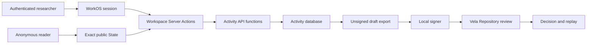

# Vela Web Workspace-promotion threat model

**Status:** reviewed current control document

**Scope date:** 2026-08-13

**Repository baseline:** applied Target and execution-lineage implementation through `03fee3e74b8e85855ced16622c7271079d291641`

**Owner:** Vela Web maintainers

**Authority effect:** none

## Executive summary

The highest-risk boundary is the crossing from an authenticated, mutable
Workspace into canonical unsigned Submission bytes. A confused-deputy or
stale-input bug there could leak another Workspace's activity, bind work to the
wrong scientific State, or prepare a plausible-looking handoff whose artifacts
were never the selected evidence. The current implementation has strong
foundations: WorkOS supplies hosted identity, every activity read and command
is tenant-checked in `SECURITY DEFINER` database functions, scientific anchors
are exact and rooted, the app role cannot read base tables or connect to the
scientific projection database, drafts are closed-schema and unsigned, and a
static boundary gate refuses hosted signing or scientific-authority code.
Target-bound Approaches now retain an exact, immutable packet binding, while
Attempts, Research Blocks, and drafts retain the selected four-root execution
lineage. These activity-plane relationships do not become Vela relations or
Decisions.

## Scope and assumptions

In scope:

- `apps/observatory/src/app/actions/activity.ts` and the authenticated draft
  export handler;
- `apps/observatory/src/components/vela/workbench.tsx` as the only hosted
  activity presentation surface;
- `apps/observatory/src/lib/auth.ts` and `apps/observatory/src/proxy.ts` for the
  hosted-account boundary;
- `packages/activity-data/src`, its migrations, roles, database privilege
  bootstrap, migration runner, role verifier, and live proof;
- `scripts/scientific-authority-boundary.mjs` and public-output checks; and
- the deployed Target-bound Approach design and execution-lineage extension in
  `docs/architecture/target-bound-approach-adr.md`.

Out of scope:

- Vela Repository admission, Verification, Decision, Event creation, replay,
  and Standing; those remain local/canonical Vela concerns;
- the Formal Conjectures audit generator and execution sandbox, which require a
  separate companion threat model;
- WorkOS, Neon, Vercel, Git hosting, or operator-device internals beyond how
  this repository configures their boundaries; and
- confidentiality of public scientific State and public source-owned Research
  Blocks.

Assumptions confirmed for this pilot:

- the product is Internet-exposed; scientific State is public and hosted
  activity requires a valid WorkOS session;
- the activity database is multi-workspace, and `owner` and `member` currently
  have the same rights for eligible activity mutations;
- object authorship grants no extra mutation right, except that a private note
  is readable only by its author;
- Attempt and Artifact locators are visible to every member of their Workspace,
  but must not enter signed-out or public output; and
- a local signer, eligible verifier, or Repository Decision authority receives
  no additional hosted-activity right merely because it holds that external
  role.

Open questions that can change future risk, but do not block this design:

- whether a later product policy needs recipient-scoped private locators;
- whether Workspace membership administration will become an application
  surface rather than an operator-only/database concern; and
- what authenticated-write quotas are appropriate once usage and artifact
  locator sensitivity are measured.

## System model

### Primary components

- **Public scientific reader.** `@vela/observatory-data` reads an exact,
  SELECT-only projection. It does not depend on mutable activity data.
- **Hosted account adapter.** `currentAccount()` validates configuration and
  obtains the WorkOS session identity. The WorkOS identity is explicitly not a
  Vela actor (`apps/observatory/src/lib/auth.ts`,
  `packages/activity-data/migrations/20260811_activity_v1.sql`).
- **Workspace Server Actions.** The single declared mutation surface parses
  bounded form fields, reloads exact scientific State, recomputes the anchor,
  requires the browser-rendered expected anchor, and maps the WorkOS identity
  to an activity account (`apps/observatory/src/app/actions/activity.ts`).
- **Activity data package.** Server-only TypeScript validates contracts,
  canonicalizes request roots and drafts, and calls a fixed SQL function
  vocabulary (`packages/activity-data/src/activity.ts`).
- **Activity database.** The `vela_activity_app` role has only `USAGE` on
  `activity_api` and `EXECUTE` on reviewed functions. Tenant, anchor,
  idempotency, lifecycle, visibility, and version policy lives in
  `SECURITY DEFINER` functions with a fixed search path
  (`packages/activity-data/migrations/20260811_activity_v1.sql`).
- **Local signer.** A separate CLI reads an explicit local PKCS#8 file, checks
  the public key declared by the draft, signs a DSSE envelope, and creates a
  new mode-0600 output file (`packages/activity-data/scripts/sign-submission-draft.mjs`).
- **Boundary gates.** Static checks keep the mutable and scientific planes
  acyclic, disallow hosted authority secrets and signing, and scan public output
  (`scripts/scientific-authority-boundary.mjs`,
  `scripts/check-public-output.mjs`).

### Data flows and trust boundaries

- **Anonymous browser -> Observatory reader.** Public HTTP reads carry no
  activity credential. Exact State and source-owned public Research Blocks are
  available; `Workbench` returns the sign-in surface before loading any
  activity data. Validation is the read-model's exact-root contract.
- **Browser -> WorkOS -> hosted account adapter.** The browser carries the
  AuthKit session cookie over the deployed HTTPS boundary. Repository evidence
  shows configuration validation and `withAuth()` use; rate limiting and
  provider-internal session controls are not established here.
- **Authenticated form -> Workspace Server Action.** Form data carries route
  scope, Workspace id, expected scientific-anchor root, idempotency key, and
  bounded activity fields. Server Actions validate lengths, reload State, and
  reject anchor drift before calling activity data. There is no generic
  activity POST Route Handler.
- **Server Action -> `vela_activity_app`.** Parameterized Neon queries carry an
  activity account id, Workspace id, command kind, request root, payload, and
  expected version. SQL requires membership, serializes idempotency keys, and
  applies composite Workspace/anchor relationships. The app role cannot access
  base tables or the Observatory database.
- **Activity package -> external locator.** Only a locator string, content
  root, bounded metadata, and optional byte count are retained. No bytes are
  fetched or stored. Locator text is untrusted and currently displayed as text
  inside an authenticated Workspace.
- **Draft export -> local signer.** An authenticated member downloads canonical
  unsigned JSON with `private, no-store` and exact payload headers. The local
  CLI, not hosted code, reads a private key and writes the signed envelope.
- **Signed Submission -> Vela Repository.** This occurs outside Vela Web.
  Repository policy, scoped Verification, an authorized human Decision, and
  replay govern any scientific effect.

#### Diagram

## Assets and security objectives

| Asset | Why it matters | Security objective |
|---|---|---|
| Workspace membership and account mapping | Prevents cross-tenant reads and writes | C, I |
| Private notes and hosted locators | May contain unpublished research or custody locations | C, I |
| Scientific anchor and future Target binding | Determines which exact State and work packet activity references | I |
| Activity records and append-only audit | Preserve coordination history, authorship, idempotency, and conflict evidence | I, A |
| Unsigned Submission payload and payload root | Defines the exact bytes a user may choose to sign | I |
| WorkOS secrets and activity database credential | Compromise permits hosted identity or data-plane abuse | C, I, A |
| Local signing key | Controls producer attribution outside the hosted service | C, I |
| Scientific projection and Repository authority credentials | Must remain unreachable from mutable hosted activity | C, I |
| Public output | Must not disclose private account, locator, registry, or secret material | C, I |

## Attacker model

### Capabilities

- An anonymous Internet user can manipulate public URLs and unauthenticated
  requests.
- An authenticated account can submit arbitrary form values, guess UUIDs,
  reuse idempotency keys, race versions, supply long or malicious text, and try
  to bind activity to a stale or substituted scientific object.
- A malicious Workspace member can read all Workspace-visible activity and
  locators and can perform every currently eligible member mutation.
- Untrusted artifact and external-session locators may contain misleading
  schemes, prompt injection, or references to mutable bytes.
- A supply-chain or deployment attacker may attempt to introduce a hosted
  signer, authority credential, permissive database grant, or second write
  route.

### Non-capabilities

- Mere membership, object authorship, a passing producer check, local signing,
  or verifier status does not grant Repository Decision authority.
- The normal application role cannot read activity base tables, connect to the
  Observatory database, create roles/databases, or access a Repository key.
- The current product neither fetches artifact locators nor runs external
  sessions or contributor code.
- Vela Web does not make scientific truth, fidelity, acceptance, or
  independence claims from hosted activity.

## Entry points and attack surfaces

| Surface | How reached | Trust boundary | Notes | Evidence |
|---|---|---|---|---|
| Public State routes | Anonymous HTTP GET | Internet -> exact reader | SELECT-only scientific projection | `apps/observatory/src/app/p/[repository]/[problem]/page.tsx`; `AGENTS.md` |
| AuthKit proxy and `currentAccount` | Browser session | Internet -> WorkOS -> app | Hosted identity only; validates redirect and cookie configuration | `apps/observatory/src/proxy.ts`; `apps/observatory/src/lib/auth.ts` |
| Workspace Server Actions | Authenticated form submit | Browser -> server | One declared action file; recomputes exact anchor | `apps/observatory/src/app/actions/activity.ts` |
| Draft export | Authenticated GET | Browser -> server -> activity API | Membership-required canonical bytes; private/no-store | `apps/observatory/src/app/drafts/[id]/export/route.ts`; `activity_api.export_submission_draft` |
| Activity SQL API | Parameterized SQL | server -> separate database | `SECURITY DEFINER`, fixed search path, membership and command allowlist | `packages/activity-data/src/activity.ts`; `packages/activity-data/migrations/20260811_activity_v1.sql` |
| Artifact/session locator fields | Authenticated forms | untrusted text -> Workspace | Stored as metadata; not fetched; Workspace-visible | `attachArtifactAction`; `createAttemptAction`; `RootedArtifactFrame` |
| Local signing CLI | Local filesystem/CLI | unsigned hosted bytes -> user key | Explicit file paths, key match, exclusive mode-0600 output | `packages/activity-data/scripts/sign-submission-draft.mjs`; `src/local-signing.ts` |
| Migration and role tooling | Operator CLI | operator -> Neon | Separate migrator/app credentials; exact migration ledger | `packages/activity-data/scripts/schema.mjs`; `scripts/verify-roles.mjs` |
| Build and boundary gates | CI/local Bun commands | source -> deployable artifact | Static authority and public-output policy | `scripts/scientific-authority-boundary.mjs`; `scripts/check-public-output.mjs` |

## Top abuse paths

1. **Cross-tenant exfiltration.** An authenticated attacker guesses a Workspace
   UUID, substitutes it in a Work URL, and asks the app role to return activity.
   `require_membership` must refuse before rows or private notes are selected.
2. **Stale Target substitution.** A member leaves a page open, the exact source
   advances, and the member posts the old anchor, Target id, or packet root.
   The Server Action must reload State and refuse rather than silently bind the
   Approach to the successor.
3. **Draft evidence substitution.** A member names an artifact digest in a
   draft that is not a selected, same-anchor Workspace Artifact or provides a
   payload root that does not match canonical bytes. A plausible handoff could
   then be locally signed without having crossed the intended evidence path.
4. **Hosted-authority creep.** A later change imports signing code or a
   Repository credential into an app route, then presents producer output as a
   Verification or Decision. Static boundary gates must fail before deployment.
5. **Private activity disclosure.** A private note, account identifier, or
   Workspace-visible locator is accidentally projected into a signed-out page,
   JSON read contract, client asset, log, or public editorial build.
6. **Locator/prompt injection.** A member stores a malicious locator or text;
   a later UI turns it into an active link or an agent follows it as an
   instruction. The current UI's inert text is safe only while that behavior is
   preserved.
7. **Retry/race corruption.** A client reuses an idempotency key with changed
   bytes or races an Attempt/draft version, producing duplicate or overwritten
   activity. Transaction locks, request roots, and expected versions must fail
   closed.
8. **Database-role escape.** A grant regression gives the app role base-table,
   TEMP, cross-database, or function-creation rights, bypassing audited policy
   functions and threatening both tenants and scientific-plane separation.
9. **Resource exhaustion.** An authenticated account creates many Workspaces or
   bounded-but-numerous activity records; without quotas it can consume
   database, build, or review capacity.
10. **Authority-by-presentation.** A dashboard, audit entry, passing producer
    check, or Target relationship is styled as accepted scientific State even
    though no Repository Decision exists.

## Threat model table

| Threat ID | Threat source | Prerequisites | Threat action | Impact | Impacted assets | Existing controls | Gaps | Recommended mitigations | Detection ideas | Likelihood | Impact severity | Priority |
|---|---|---|---|---|---|---|---|---|---|---|---|---|
| TM-001 | Authenticated outsider or stolen app credential | Workspace/account identifiers or app DB access | Read or mutate another Workspace by substituting ids | Unpublished research exposure and activity corruption | Membership, notes, locators, records | WorkOS session in `currentAccount`; SQL `require_membership`; composite Workspace/anchor FKs; cross-tenant live proof | SQL functions trust the account id supplied by the server credential | Keep DB credential server-only; retain read, write, export, and removed-member probes in `live-proof.mjs`; alert on repeated `VA403` | Count authorization refusals without logging sensitive payloads | medium | high | high |
| TM-002 | Malicious or stale member client | Valid membership and old/substituted Target fields | Bind an Approach to an unseen successor or wrong packet | False provenance and incorrect downstream promotion | Anchor, Target packet, draft | Exact server write gate; `mutationContext` reloads State; `requireExpectedAnchorRoot`; current-offer guard; applied immutable Target binding; parent packet match; downstream all-or-none execution binding copied from the exact current offer; direct-form and disposable-database tests | The activity database cannot determine whether an external Target offer is current; a compromised application credential could bypass that application-owned check | Keep the current-offer re-read and exact packet-root refusal at the action boundary; retain immutable binding and audit mismatch/conflict outcomes | Audit conflict counts and packet-root mismatches | medium | high | high |
| TM-003 | Supply-chain/deployment change | Ability to change or deploy hosted code/config | Add signer, Verification/Decision writer, authority key, or scientific table | Unauthorized scientific action or credential theft | Local key, Repository authority, Standing | Static authority scanner; app/local signer dependency split; role/database separation; no secret columns | Static patterns are not a complete semantic proof | Keep forbidden symbols/schemas/secrets executable; review any activity boundary-file change; scan deployment config and output | CI gate failures; secret-scanner alerts; unexpected environment keys | low | high | high |
| TM-004 | Workspace member or compromised app | Draft creation/export rights | Substitute artifact, payload, or root before local signing | Signed proposal does not reflect selected evidence | Artifact roots, draft bytes | The action derives the payload Artifact from the selected stored Research Block; Ajv closed schema and canonical JSON/root checks; SQL requires the same-Workspace/same-anchor Artifact id, exact four-root execution-binding equality, and refuses draft rebinds; membership-gated export; key match in local signer | SQL does not independently compare the payload Artifact digest/path with the selected Artifact or recompute the canonical payload root; a compromised application credential remains able to supply inconsistent payload bytes | Keep application derivation mandatory; retain exact Artifact/binding SQL checks, no-rebind policy, export canonicalization, and focused substitution/root tests; add a database-owned payload-to-Artifact comparison before any broader promotion surface | Root mismatch telemetry without payload content | low | high | high |
| TM-005 | Outsider, member, build leak | Route/bundle access or Workspace membership | Expose private note, PII, or locator beyond its intended audience | Confidentiality breach | Notes, account data, locators | Private-note author filter; signed-out Workbench exits before activity load; public-output scan; no public activity JSON route | Locators are Workspace-wide by current policy; no recipient-scoped locator type | Do not broaden visibility; add public-output fixture markers; consider locator privacy only after a concrete requirement | Public-output scan; access audit; incident marker search | medium | high | high |
| TM-006 | Malicious member or external source | Ability to enter text/locator | Store dangerous scheme, mutable reference, or prompt injection for a human/agent | Misleading custody, unsafe navigation, downstream agent compromise | Locators, operators, external sessions | Length limits; React escaping; hosted artifact locator rendered as inert text; no fetch/runtime | No locator scheme or immutability policy; future consumers may activate it | Keep inert by default; before link/fetch, introduce allowlisted schemes, explicit access class, immutable-root verification, and agent instruction isolation | Log rejected schemes and fetch attempts | medium | medium | medium |
| TM-007 | Concurrent/retrying member | Valid mutation rights | Reuse key with changed input or overwrite a changed version | Duplicate, lost, or inconsistent activity | Activity records, audit | Canonical request root; advisory lock; idempotency table; Attempt/draft versions; live proof | Immutable record types have no update path; currentness is app-enforced | Preserve request-root and version checks in Target migration; add migration compatibility and concurrent-write tests | Conflict and idempotency-reuse counts | medium | medium | medium |
| TM-008 | Compromised app/migrator or grant regression | Database credential or migration rights | Bypass API functions or cross into scientific DB | Bulk tenant corruption or scientific-plane compromise | Both data planes, audit | NOINHERIT roles; PUBLIC revocations; fixed DB; no TEMP; app no base tables; bidirectional role verifier | Migrator remains privileged; role proof requires live credentials | Require review for role/migration files; run `db:verify` and live proof on frozen bytes; rotate compromised credentials | Database grant diff and role-verifier failures | low | high | medium |
| TM-009 | Authenticated resource attacker | Account access | Generate high volumes of bounded activity or expensive reads | Availability and cost degradation | Database and app availability | Field lengths; fixed command vocabulary; 100-entry audit read bound | No repository-evidenced per-account/workspace quotas | Measure first; add quotas/rate limits before public write expansion; bound future artifact list sizes | Per-account command rate, row growth, latency | medium | medium | medium |
| TM-010 | UI/consumer author | Ability to change presentation | Treat activity, producer checks, or a Target link as Verification/acceptance | Scientific authority confusion | User trust, Standing semantics | Product copy; separate State/activity planes; scanner forbids authority writes; explicit unsigned handoff | Copy checks cannot prove all visual implications | Retain `authority_effect: none`; render source/check/semantic/Standing axes separately; review copy and browser states | Wording-contract and screenshot review | medium | medium | medium |
| TM-011 | Malicious payload or old client | Draft/API access | Use unsupported schema or extra authority fields | Parser differential or authority smuggling | Draft integrity | Ajv 2020 closed schema; pinned schema root; SQL schema/agent boundary; parser fails closed | SQL alone performs fewer checks than TypeScript | Keep TypeScript validation mandatory; fail closed on versions; test unknown properties and schema roots | Invalid-schema outcome counts | low | high | medium |
| TM-012 | Build/deployment mistake | Public artifact generation | Ship private account/locator/secret material in browser or editorial output | Broad confidentiality loss | Secrets, PII, private research | Static www; output scanner; activity dependency allowlist; signed-out activity gate | Marker scan is pattern-based | Add representative locator/account markers to public-output tests; inspect actual build output on release | CI scan and post-build artifact inspection | low | high | medium |

## Exact implementation permission matrix

This matrix records current behavior. It is not aspirational. “Author” means an
object's `created_by_account_id`, `author_account_id`, or equivalent; authorship
adds no mutation right except private-note read. “External role” means local
signer, eligible verifier, or Decision authority without a Workspace
membership. Any cell not explicitly allowed is denied.

| Object / action | Anonymous | Hosted account, no membership | Workspace owner | Workspace member | Object author | External role | Hosted service enforcement |
|---|---|---|---|---|---|---|---|
| Read public Current State and source Research Blocks | allow | allow | allow | allow | no extra right | allow | exact `@vela/observatory-data` read; no activity credential |
| Sync own hosted Account | deny | allow | allow | allow | no extra right | no extra right | `currentAccount` -> `ensureCurrentAccount` -> `activity_api.ensure_account` |
| Create Workspace / list own Workspaces | deny | allow | allow | allow | no extra right | no extra right | `createWorkspaceAction`; `activity_api.create_workspace`; `list_workspaces` joins membership |
| Read Workspace activity | deny | deny | allow | allow | no extra right | no extra right | `Workbench` -> `getProblemActivity`; SQL `require_membership` |
| Read private note | deny | deny | allow only if author | allow only if author | allow within own Workspace | no extra right | `x.visibility='workspace' OR x.author_account_id=p_account_id` |
| Read Attempt or Artifact locator | deny | deny | allow | allow | no extra right | no extra right | returned only by membership-gated activity read; no public activity route |
| Follow exact current anchor | deny | deny | allow | allow | no extra right | no extra right | `followProblemAction`; expected-anchor guard; `follow.set` |
| Create unbound Approach | deny | deny | allow | allow | no extra right | no extra right | `createApproachAction`; expected-anchor guard; `approach.create` |
| Create Target-bound Approach | deny | deny | allow only with exact server flag `true` | allow only with exact server flag `true` | no extra right | no extra right | applied additive migration; distinct bound action; top-of-action default-off feature gate; current-offer guard; exact packet-root match |
| Fork Approach | deny | deny | allow | allow | no extra right | no extra right | current anchor + expected version in action; membership + version in `approach.fork` |
| Create/update Attempt | deny | deny | allow | allow | no extra right | no extra right | current Approach/Attempt guard; membership; lifecycle and optimistic version policy; a bound parent requires the full current-offer execution binding and an unbound parent requires null |
| Add comment/private note | deny | deny | allow | allow | no extra write right | no extra right | same-anchor target checks; private read remains author-only |
| Create work request / attach Artifact reference | deny | deny | allow | allow | no extra right | no extra right | same-anchor target checks; assignee membership; roots/metadata only; Artifact must copy the selected Attempt's exact binding |
| Create unsigned draft | deny | deny | allow | allow | no extra right | no extra right | current-anchor action; selected same-anchor Artifact; exact Artifact binding equality and no rebind; Ajv schema; agent/CI identity match; `submission_draft.save` |
| Export canonical unsigned draft | deny | deny | allow | allow | no extra right | no extra right | authenticated GET; `export_submission_draft`; `private, no-store` |
| Sign Submission | deny | deny | deny as hosted role | deny as hosted role | no extra right | allow only at local boundary with matching declared key | hosted import/signing/key access forbidden; local CLI only |
| Produce Verification / issue Decision / change Standing | deny | deny | deny | deny | deny | governed by external Repository policy, never hosted role | no handler, table, function, credential, or allowed schema |

### Handler, policy, role, and test bindings

| Capability | Current handler or command | Database policy/function | Role boundary | Executable evidence |
|---|---|---|---|---|
| Hosted identity | `currentAccount`; `actor` | `activity_api.ensure_account` validates WorkOS-shaped id | app role may execute only | `apps/observatory/src/lib/auth.test.ts`; `apps/observatory/src/app/actions/auth.test.ts` |
| Workspace create/list | `createWorkspaceAction`; `listWorkspaces` | `create_workspace`; membership join in `list_workspaces` | app API only | `packages/activity-data/tests/governance.test.ts`; live proof |
| Activity read/privacy | `loadWorkbench` | `get_problem_activity`; `require_membership`; author-only private-note predicate | app API only; no base read | governance test; live cross-tenant/private-note proof |
| Target-bound write enablement | `VELA_TARGET_BOUND_APPROACH_ENABLED`; exact `true` only; gate precedes `mutationContext` | no privilege or database override | deployment-owned server configuration | config parser, direct-POST, disabled UI, and boundary tests |
| Ten Workspace-scoped activity mutations | ten named exports in `app/actions/activity.ts` after the separately listed Workspace creation action; bound and unbound creation share one closed database command | nine-kind allowlist in `execute_command`; `require_membership`; append-only audit | app API only | governance test; authority-boundary test; live proof |
| Direct stale form refusal | `mutationContext`; `requireExpectedAnchorRoot` | database preserves exact supplied anchor but does not decide currentness | server owns current scientific read | `workspace-mutation-guard.test.ts` |
| Version/idempotency conflict | `requireCurrentApproach`; `requireCurrentAttempt`; command request root | advisory lock; `VAI01`; `VACAS`; lifecycle transitions | app API only | guard tests; migration-plan tests; live proof |
| Draft validation/export | `saveSubmissionDraftAction`; `GET /drafts/[id]/export` | `submission_draft.save`; selected Artifact id and exact execution-binding equality; no rebind; `export_submission_draft`; membership | app API only | `draft-submission.test.ts`; governance and disposable-database lineage tests; live export denial |
| Local signature | `activity:submission:sign-local` | none | local filesystem and user key; no server right | `draft-submission.test.ts` success and mismatched-key refusal |
| Role/cross-plane isolation | operator scripts only | grants/revocations; fixed DB identity | owner, migrator, app, projection reader separated | `boundary.test.ts`; `db:verify`; `db:live-proof` |
| Scientific authority denial | no hosted capability | no activity scientific relation/function | no Repository credential | `scientific-authority-boundary.test.ts`; `check:boundary` |

## Criticality calibration

- **Critical:** an unauthenticated or ordinary member path directly signs a
  Repository action, extracts a Repository authority key, or changes canonical
  Standing. A cross-plane database escape with immediate canonical write access
  is also critical. No current path meeting this definition was found.
- **High:** cross-tenant Workspace disclosure or corruption; accepting a stale
  or substituted Target packet into a promoted draft; exporting private
  research publicly; or introducing a hosted signer/Decision path. TM-001
  through TM-005 fall here.
- **Medium:** locator/prompt abuse without automatic execution; bounded
  availability attacks; idempotency/version conflict; a privileged migration
  regression caught by release verification; or activity presented with
  misleading authority semantics.
- **Low:** cosmetic metadata leakage already visible to all intended Workspace
  members, noisy authenticated failures, or a denial of service that is
  trivially reversible and affects no retained data. No low item is used to
  waive a required boundary test.

## Focus paths for security review

| Path | Why it matters | Related threats |
|---|---|---|
| `apps/observatory/src/app/actions/activity.ts` | Authentication, exact-current State recheck, input bounds, and all hosted mutations converge here | TM-001, TM-002, TM-004, TM-007 |
| `apps/observatory/src/app/actions/workspace-mutation-guard.ts` | Encodes direct-form stale-root and optimistic-version refusal | TM-002, TM-007 |
| `apps/observatory/src/app/drafts/[id]/export/route.ts` | Last hosted boundary before local signing | TM-001, TM-004, TM-005 |
| `apps/observatory/src/components/vela/workbench.tsx`; `workspace-object-tree.tsx` | Separates signed-out public State from membership-gated activity; keeps Target and Work groups distinct while exposing exact relation links; renders locators/authority copy | TM-002, TM-005, TM-006, TM-010 |
| `apps/observatory/src/lib/auth.ts` | Maps WorkOS session identity to the hosted account boundary | TM-001, TM-005 |
| `apps/observatory/src/lib/target-bound-approach.ts` | Parses the server-only, default-off Target-bound write gate | TM-002, TM-007 |
| `packages/activity-data/src/activity.ts` | Fixed SQL vocabulary, canonical request roots, and draft export client | TM-001, TM-004, TM-007 |
| `packages/activity-data/src/draft-submission.ts` | Closed schema and canonical unsigned bytes | TM-004, TM-011 |
| `packages/activity-data/src/local-signing.ts` | Sole allowed signing implementation and key-match check | TM-003, TM-004 |
| `packages/activity-data/migrations/20260811_activity_v1.sql` | Tenant policy, `SECURITY DEFINER` functions, audit, versions, and grants | TM-001, TM-004, TM-007, TM-008 |
| `packages/activity-data/migrations/20260812_current_anchor_read.sql` | Current/historical follow semantics and membership-gated activity response | TM-001, TM-002 |
| `packages/activity-data/migrations/20260812_target_bound_approach.sql` | Additive immutable Target provenance, literal no-authority constraint, and fork inheritance | TM-002, TM-007, TM-010 |
| `packages/activity-data/migrations/20260813_execution_binding_lineage.sql` | Extends all-or-none packet/profile/capsule/result-contract lineage through Attempt, Research Block, and draft; enforces exact parent equality and refuses draft rebinds | TM-002, TM-004, TM-007, TM-010 |
| `packages/activity-data/roles.sql` | Defines the non-login owner and least-privilege login roles | TM-008 |
| `packages/activity-data/database-privileges.sql` | Enforces database-level cross-plane isolation | TM-008 |
| `packages/activity-data/scripts/live-proof.mjs` | Starts from zero bound rows, then proves exact bound create/read/fork/retry/audit plus tenant, privacy, export, role, and plane independence | TM-001, TM-002, TM-004, TM-005, TM-007, TM-008 |
| `scripts/scientific-authority-boundary.mjs` | Prevents hosted authority, signing, key, route, and dependency creep | TM-003, TM-010, TM-011 |
| `scripts/check-public-output.mjs` | Last static check against public secret/private-data leakage | TM-005, TM-012 |

## Mitigation and operational gate summary

The Target and execution-lineage migrations are applied at their frozen roots.
The binding-aware reader/action/UI is deployed, the Target-bound write gate is
enabled with exact `true`, and the rollback floor remains the binding-aware
default-off build identified in the ADR. The implemented gates are:

1. exact typed read/write contracts, fail-closed all-or-none roots, a
   top-of-action feature gate, and an application-owned current-offer re-read;
2. immutable Target binding on Approach plus exact execution-binding equality
   from Approach to Attempt to Research Block to draft;
3. membership, same-anchor, optimistic-version, idempotency, audit, and
   `authority_effect = 'none'` enforcement in the activity database;
4. role/database separation, boundary/public-output checks, and a local-only
   signer; and
5. retained migration roots, production deployment/projection identities, and
   an explicit forward-fix rollback rule.

The full authenticated browser matrix remains open: narrow-screen, keyboard,
zoom, reduced-motion, forced-colors, and touch behavior still require retained
production evidence. The database also cannot determine whether an external
offer is current, compare a draft payload's Artifact digest/path with the
selected Artifact, or recompute the canonical draft root. Those controls remain
application-owned residuals and must not be described as database proof.

High-risk controls remain owned as follows: Vela Web maintainers own Server
Action and UI guards; activity-data maintainers own SQL policy and role tests;
deployment operators own credential isolation and live proofs; the local user
owns the signing key; Repository authorities own Verification, Decision, and
Standing.

## Quality check

- [x] Covered every discovered hosted activity entry point and the local signer.
- [x] Represented the public/read, identity, Server Action, database, locator,
  local-signing, and Repository boundaries in at least one abuse path.
- [x] Separated runtime behavior from migration/build/CI tooling and tests.
- [x] Reflected confirmed owner/member, private-note, and locator assumptions.
- [x] Marked FC audit execution and Vela Repository authority out of scope.
- [x] Bound every current allow/deny rule to a handler, SQL function, role, or
  local command and named executable evidence.
